# Weather data platform

A local pipeline that ingests NOAA GHCN-Daily weather data for the airports of Canada's five largest
metropolitan areas, transforms it with dbt on DuckDB, and writes daily weather narratives with
Gemini, each one validated against the data it describes.

Stations and elements are chosen from NOAA's own metadata, not hard-coded: adding a sixth city is
one line of configuration. Data quality is measured at every layer, bad values are quarantined
rather than silently dropped, and every stage records what it did in an `ops` ledger that one
command turns into a health report.

[](https://github.com/apmalong/weather-data-platform/actions/workflows/ci.yml)
CI runs the whole pipeline against live NOAA data on every push, from a clean checkout.

## Who this is for

NOAA's daily records are reliable but hard to use: one fixed-width file per station, coded
elements in tenths of units, quality flags that are easy to miss, and gaps that look like zeros.

- **People who want a plain daily summary**, such as an operations manager with sites in several
  cities or a regional news desk: "Calgary had 15 cm of snow and a low of -22 °C." They can't check
  the source, so the narratives have to be short and correct. That's why every narrative is
  validated against the data, and repaired or flagged when it fails.
- **Analysts** who want clean, tested daily weather by city to join with their own data (sales,
  staffing, energy, deliveries). The marts are for them, with data quality and freshness measured
  so they can tell when the gap is in the weather data, not in their own.

It is not a forecast (NOAA's daily data arrives 1–3 days late) and not hyperlocal (one airport
station per metro area), and the narratives describe the weather, never its effects. Success means
correct narratives, ready by the next morning, with data tests passing and core elements complete.

## Quick start

You need [uv](https://docs.astral.sh/uv/getting-started/installation/) (it installs Python 3.12 for
you) and an internet connection. No database server, no Docker, no API key required.

```bash
git clone https://github.com/apmalong/weather-data-platform.git
cd weather-data-platform
uv sync                      # Python 3.12 + locked dependencies
cp .env.example .env         # optional: add GEMINI_API_KEY (free, no billing: aistudio.google.com/apikey)
uv run wx run                # ingest -> dbt build (models + tests) -> narratives -> report: ~1 min (~3 with Gemini)
```

Then open **`data/report.html`** in a browser: the weather, data quality, narratives with their
validation, prompt evaluation and pipeline operations on one page. `uv run wx health` prints the
same health summary in the terminal.

Without `GEMINI_API_KEY`, narratives come from an offline mock provider with the same interface,
so every stage runs end to end; with a key, the same command uses Gemini.

| Command | What it does |
|---|---|
| `wx ingest` | Downloads NOAA's reference files, resolves each configured city to a station from the metadata, downloads and loads its observations (skipping unchanged files) |
| `wx transform` | `dbt build`: 20 models across staging, intermediate and marts, plus 69 data tests and a unit test. `--full-refresh` rebuilds from raw |
| `wx narrate` | Daily narratives for the last 14 days, in batches, validated against the data; cached, so reruns only do new or revised days |
| `wx eval` | Scores a narrative prompt and model on hard cases (`evals/cases.yml`): `--prompt prompts/narrative_v1.md` |
| `wx health` | One report: runs, checks, dbt tests, data quality, NOAA's revisions, narratives, evaluation. `--strict` exits 1 on errors |
| `wx report` | Writes `data/report.html`: one self-contained page, data embedded, nothing to install or serve |
| `wx run` | `ingest`, `transform`, `narrate`, `report` |
| `wx reset` | Start over: the warehouse (keeps downloads); `--all` also the downloads and report, like a fresh clone; `--narratives` only the narrative cache. Asks first unless `--yes` |
| `wx --explore` | Opens the warehouse in DuckDB's web UI at http://localhost:4213, read-only; before a command (`wx --explore run`), once the command finishes. Ctrl+C stops it |

Everything lands in one DuckDB file, `data/warehouse.duckdb`. Open it with the DuckDB CLI or any
SQL client, for example:

```sql
select city, obs_date, tmax, tmin, prcp, prcp_status, snow, wsfg from marts.mart_station_daily
order by obs_date desc, city limit 10;

select city, obs_date, narrative, passed from narratives.latest join marts.dim_station using (station_id)
order by obs_date desc limit 10;
```

To run it on a schedule instead, see [Orchestration](#orchestration-optional).

## Architecture

```mermaid
flowchart LR
  cfg["config/pipeline.yml<br/>cities, window, element policy,<br/>quality thresholds, narratives"]
  noaa[("NOAA GHCN-Daily<br/>stations, inventory, countries,<br/>states, readme, status<br/>+ by_station/*.csv.gz")]
  subgraph ingest["wx ingest (Python)"]
    fetch["download + fingerprint<br/>(skip unchanged)"]
    parse["fixed-width at the readme's<br/>positions; element catalog<br/>parsed from the readme"]
    resolve["resolve cities to stations<br/>from stations + inventory"]
    merge["merge observations,<br/>row-level change log"]
  end
  subgraph wh["DuckDB: data/warehouse.duckdb"]
    raw["raw.*<br/>as published"]
    conf["config.*<br/>this run's scope"]
    stg["staging.*<br/>typed"]
    int["intermediate.*<br/>scope + assessment"]
    marts["marts.*<br/>facts, dims, daily,<br/>quality, changes"]
    narr["narratives.*"]
    ops["ops.*<br/>runs, downloads, loads, checks,<br/>dbt results, LLM calls, evals"]
  end
  llm["Gemini (or offline mock)"]
  cfg --> ingest
  noaa --> fetch --> parse --> raw
  parse --> resolve --> merge --> raw
  resolve --> conf
  raw --> stg --> int --> marts
  conf --> int
  marts -->|"wx narrate:<br/>batched, cached"| llm -->|"validated against<br/>the facts"| narr
  ingest -.-> ops
  marts -.->|"dbt on-run-end"| ops
  narr -.-> ops
  ops -->|"wx health"| report["health report"]
```



| Layer | Models | Purpose |
|---|---|---|
| `raw` | observations (+ change log), stations, inventory, countries, states, element catalog, documents | NOAA's files as published, all text, with lineage |
| `config` | selected_stations, window, elements, quality | This run's scope, published by ingest, so dbt needs nothing but the warehouse |
| `staging` | `stg_ghcnd__*`, `stg_config__run_scope` | Typed and parsed; nothing fails a cast, it fails a test |
| `intermediate` | selected stations, elements in scope, station-element coverage, assessed observations | Scope from the metadata; every value scaled and given a quality status |
| `marts` | `fct_observations` (incremental), `fct_station_day_element`, `mart_station_daily`, `mart_data_quality`, `mart_source_changes`, `mart_narrative_input`, `dim_station`, `dim_element` | What people and the narratives use |

## Design decisions

### Stations come from the metadata

`config/pipeline.yml` lists cities, not station IDs:

```yaml
cities:
  - {city: Toronto, province: 'ON'}
  - {city: Montreal, province: 'QC'}
  ...
```

For each city, `wx ingest` searches `ghcnd-stations.txt` for stations in that province (or US
state) whose name starts with the city, then picks a station in two steps:

1. **Find the city's airport.** Of the stations named like an airport (`… A`, Environment Canada's
   convention; `… AP`, NOAA's for the US), prefer the international one (`INTL`, `INT'L`,
   `INTERCONTINENTAL`), then the one reporting more of TMAX, TMIN and PRCP across the window, then
   the most recent data. Calgary International beats Springbank; Montréal-Trudeau beats Mirabel,
   which reports no precipitation.
2. **Use the station at that airport that reports everything.** That's the airport's own station if
   `ghcnd-inventory.txt` shows TMAX, TMIN and PRCP across the whole window. Otherwise it's the
   nearest station that does, within `max_distance_km` (5 km). Newer Environment Canada airport
   stations often report temperature but not precipitation, while a climate station beside them
   reports both: Winnipeg uses `WINNIPEG A CS`, 1.0 km from the airport, and Regina uses
   `REGINA RCS`, 0.1 km away.

Ties go to the station with more elements, then the lowest ID, so the result never depends on the
order rows come back in. Every candidate and the reason it won or lost is recorded in
`ops.station_resolution`.

This resolves exactly the five airports in the brief. Adding a sixth city is one line,
`- {city: Edmonton, province: 'AB'}`, and nothing else changes: the station, its elements, the dbt
models, the data tests and the narratives all follow (`tests/test_resolve.py` covers this).

**Tested beyond the brief.** I ran the rules against the full metadata for 20 more Canadian cities and
15 US cities (`country: US`, state as `province`):

| | The rules pick the main airport | Needs one config field |
|---|---|---|
| Canada (20) | 18, from Edmonton to Iqaluit; 9 of them through a climate station beside the airport | Kitchener (airport station named `KITCHENER/WATERLOO`: pin `station_id`); Mississauga (its airport is Pearson, already Toronto's) |
| US (15) | 11, including Houston Intercontinental and Atlanta's `HARTSFIELD-JACKSON INT` (cut off at NOAA's 30 characters) | New York (`name_prefix: JFK`), Boston (Logan is named just `BOSTON`: pin `station_id`), Dallas (gets Love Field; DFW is `DAL-FTW WSCMO AP`: `name_prefix: DAL-FTW`), Las Vegas (gets Henderson; `name_prefix: McCarran`) |

The rules fail loudly rather than guess: a city with no airport-named station stops the
ingest with a message saying to set `name_prefix` or pin `station_id`. A pinned station must exist
and report the required elements.

**NOAA changed the station IDs the day before this brief arrived.** GHCN-Daily v3.35 (October 1,
2026) renamed every Environment Canada station from network code `0` to `N`, so Toronto Pearson is
now `CAN06158731`, not `CA006158731` as listed in the brief, and reloaded their full histories.
The old `CA0…` files are still on the server but are absent from the metadata, stopped updating on
April 28, 2024 (when Environment Canada's feed to NOAA broke), and report gusts in other units than
the readme specifies (km/h and tens of degrees). Resolving from the metadata naturally selects the
current files:

| City | Brief's file (stale) | Resolved from the metadata |
|---|---|---|
| Toronto | `CA006158731` (ends 2024-04-28) | `CAN06158731` (to 2026-09-29) |
| Montréal | `CA007025251` (ends 2024-04-28) | `CAN07025251` |
| Vancouver | `CA001108395` (ends 2025-08-24) | `CAN01108395` |
| Calgary | `CA003031092` (ends 2024-04-28) | `CAN03031092` |
| Ottawa | `CA006106001` (ends 2024-04-28) | `CAN06106001` |

### Elements come from the inventory and the readme

No element list is hard-coded. The elements in scope are those the selected stations report in the
inventory during the window, intersected with the elements the readme defines. The readme's element
section is parsed into a catalog with each element's unit and scale (`Maximum temperature (tenths of
degrees C)` gives scale 0.1, unit °C; `Snowfall (mm)` gives scale 1), so values are converted
correctly without per-element code. These stations report TMAX, TMIN, TAVG, PRCP, SNOW, SNWD, WDFG
and WSFG; not AWND, which the brief lists as common. A station that starts reporting a new element,
or a new city that reports different ones, adds columns to `mart_station_daily` automatically: the
pivot is generated from the warehouse at build time.

The fixed-width layouts are also checked against the readme: before parsing anything, ingest reads
the column tables in the downloaded readme and stops if NOAA has changed a layout.

### Data cleaning: from NOAA's files to usable values

What's wrong with the raw data, what the pipeline does about it, and where:

| In the raw data | What we do | Where |
|---|---|---|
| Two IDs per Canadian station since v3.35; the old `CA0` files stopped updating in April 2024 | Resolve stations to the current `CAN0` IDs from the metadata | `wx ingest` (resolve) |
| Fixed-width reference files | Parse with column positions read from NOAA's readme; stop if the readme's layouts change | `wx ingest` (load) |
| Malformed observation rows | Read everything as text; count rejected rows instead of failing the load | `wx ingest` (load) |
| Rows for another station, or a station/date/element twice | Keep one row per station/date/element and record how many were dropped | `wx ingest` (load) |
| Dates and values as text; sentinels like elevation `-999.9` | Cast with `try_cast`: anything that doesn't parse becomes `unparseable`, not a failed build; sentinels become null | staging |
| Values in tenths (°C ×10, mm ×10) | Scale from the readme's element definitions, at fixed precision (`decimal(12,1)`) so there's no float noise | `int_observations__assessed` |
| NOAA quality flags; physically impossible values | Mark them `qc_failed` or `out_of_bounds` (bounds in config); keep the raw value but exclude it from usable values | `int_observations__assessed` |
| Trace amounts stored as 0 | Keep 0 but give them the status `trace`, so they never read as "none" | `int_observations__assessed` |
| Days with no row at all | Build a full station × day × element grid, so every absence is a row: `missing`, `not_reported` (counted as 0 for gusts and snow depth, per config, except snow depth while snow is evidently on the ground) or `not_expected` | `fct_station_day_element` |
| Rows NOAA revises or removes | Updated in place and logged; removed rows are marked `removed_at_source` instead of deleted | `fct_observations` |
| Metric units that are awkward to read (m/s, mm of snow) | Convert to km/h and cm only for display, from config | marts and report |

**What we don't do:** fill missing days by interpolation, borrow values from a nearby station, or
correct values NOAA flagged. Each would give the narratives a number nobody measured. A gap stays
a gap, labelled with its reason, and the completeness report counts it.

Every column that records lineage, change, quality or a run (`_row_hash`, `policy_hash`,
`input_hash`, `is_deleted`, NOAA's flags, the `ops` ledger…) is explained in
[docs/metadata_columns.md](docs/metadata_columns.md). The same definitions are in the dbt YAML and are
written to the warehouse as column comments on every build.

### Data quality: detect, quarantine, measure, surface

| Layer | What is checked |
|---|---|
| Download | HTTP status, non-empty, gzip integrity, content fingerprint |
| Load | Readme layouts unchanged; rows parse; rows belong to the file's station; no duplicate station/date/element |
| Staging | Dates and values parse; quality and measurement flags are codes the readme defines; coordinates in range |
| Intermediate | Each value gets a status: `valid`, `trace`, `qc_failed` (NOAA's quality flag set), `out_of_bounds` (outside physical bounds in config), `unparseable` |
| Marts | Every station × day × element in the window gets a status, so gaps are countable rows; TMAX ≥ TMIN; TAVG within [TMIN, TMAX]; completeness; freshness per station |
| Narratives | Every narrative validated against its facts (below) |

Nothing is dropped silently: a value that fails a check stays in `fct_observations` with the reason.

**Absent doesn't always mean missing.** Environment Canada only reports a peak gust above about
31 km/h, and snow depth only when there is snow. Treating those absences as missing data would make
the completeness report wrong and the narratives say false things ("no wind data"). In config,
`absent_means_zero: [WDFG, WSFG, SNWD]` makes them `not_reported` ("nothing to report") instead of
`missing`. The freshness test found this the hard way: snow depth looked five months stale in
September. Freshness is now judged only on elements that are reported every day.

**…but snow on the ground doesn't vanish between readings.** Checking Vancouver against Environment
Canada's own daily record (the `climate-daily` collection at `api.weather.gc.ca`) found 2 February
2025: 4 cm on the ground and 5.8 cm of new snow per Environment Canada, but no snow-depth row in
NOAA's file, so the pipeline said "0 cm on the ground". Snow depth is now `persistent` in config:
an absent day between two non-zero readings, or on a day with new snowfall, is `missing`, not zero.
That changed 72 days across the five stations. For Toronto and Calgary I checked all 45 of theirs
against Environment Canada: on 21 it had snow on the ground that NOAA's file lacks, on 24 it had no
reading either, and on none did it say zero. A dbt unit test pins the February 2025 sequence.
The same check confirmed the rest: Vancouver's 2025–26 winter had no measurable snowfall, only the
three trace days Environment Canada reported (20 February, 10 and 15 March 2026).

**Trace amounts** (`mflag T`) are stored as 0 but keep their status, so a narrative says "a trace
of rain", never "no rain".

### Incremental by change, not by date

NOAA revises past values, adds quality flags later, and backfills gaps: v3.35 reloaded 17 months of
Canadian data at once. Loading only "dates after the last load" would silently miss all of that.

- **Files:** every download is fingerprinted (SHA-256). An unchanged file isn't parsed again.
  NOAA's `Last-Modified` header can't be used for this: the frozen `CA0…` files show yesterday's date.
- **Rows:** a changed file is merged row by row. New, changed and vanished rows are applied and
  logged in `raw.observation_changes`; `mart_source_changes` counts NOAA's revisions per run.
- **dbt:** `fct_observations` is incremental and reprocesses only rows NOAA changed (from the change
  log, removals as tombstones), rows of an element whose policy changed in config (bounds, scale,
  absent rule), and stations or elements newly in scope. Verified on a copy of the warehouse: four
  simulated NOAA changes rewrote exactly four rows; changing TMAX's upper bound rewrote only TMAX's
  rows. `--full-refresh` is needed only when model SQL itself changes.
- **Narratives:** cached by a fingerprint of their input facts, the model and the prompt version, so
  a narrative is regenerated only when its facts change.

### Narratives

`wx narrate` reads `marts.mart_narrative_input`, one fact sheet per station-day built only from the
marts: each fact has a label, a value in display units (gusts in km/h, snow in cm, set in config),
its status and, for wind direction, the compass point, computed in SQL. Requests carry 10
station-days at a time, and Gemini returns structured JSON: the narrative plus every figure it used
and which element it came from.

- **The connector:**
  - **Key:** read only from the environment or a git-ignored `.env`; never logged.
  - **Models:** pinned versions tried in configured order, never `-latest` aliases that can change
    behaviour silently. A model retired for the key falls through to the next (`gemini-2.5-flash`
    was already retired for new keys while this was built). Run `wx eval` before changing models.
  - **Free-tier limits:** they're per project, shown only in AI Studio and liable to change, so the
    connector paces requests, waits the delay the API asks for on a per-minute 429, and on an
    exhausted daily quota moves to the next model and then stops cleanly. The cache means the next
    run resumes where it stopped.
  - **Graders' keys:** the same code path runs with any key. Without one it uses the mock.
- **Nothing to describe, nothing to invent:** a day with no usable temperature or precipitation gets
  a fixed "No readings were available" sentence instead of a model call.
- **One repair attempt:** a narrative that fails validation goes back to the model once, in a batch
  with the other failures, each with its previous text and the exact checks it failed. The failed
  first attempt is kept as history; the repair becomes current if it passes, and stays flagged if
  it doesn't. Failures from earlier runs (or a run whose quota ran out) are repaired by the next
  one. In practice: one production narrative cited `TMAX = 0.0` for a missing temperature while its
  text was right; one repair request fixed it, and all 70 current narratives pass.
- **Validation** (the bonus "compare narratives against source data"), on every narrative before
  it's stored. A failed check fails the narrative:

  | Check | Fails when |
  |---|---|
  | `cited_values_match` | a figure the model says it used doesn't match the fact it names |
  | `cited_only_usable` | it cites a value that failed quality checks or wasn't reported |
  | `numbers_grounded` | any number in the text doesn't match a usable fact (rounding allowed) |
  | `high_low_attribution` | "a high of N °C" isn't TMAX, or "a low of N °C" isn't TMIN |
  | `compass_matches` | it names a wind direction other than the compass point it was given |
  | `no_false_zero` | "dry", "no rain" or "no snow" when the value was a trace, positive or missing |
  | `no_false_gaps` | it calls a reading missing when the reading was usable |
  | `no_invented_topics` | things it wasn't given: forecasts, humidity, cloud, hail, sleet, records… |
  | `names_own_city` | it names another city |

  Warnings, recorded but not failing: intensity words the data doesn't support (thresholds in
  config, after Environment Canada's warning criteria: heavy rain from 25 mm, heavy snow from 15 cm,
  bitterly cold at −20 °C…), its own city not named, temperatures not mentioned, gaps not
  acknowledged, length.

- **Hallucinations found, and what changed.** Re-scoring every stored Gemini narrative with the
  full check list found one real, recurring hallucination: **wrong wind directions in 19 of 103
  narratives (18%) written with prompt v2**, e.g. 290° written as "NW" (it's W). The model was being
  asked to convert degrees to compass points, and it gets that arithmetic wrong; the old checks only
  looked at numbers. The fix moved the conversion out of the model: the compass point is computed in
  SQL and given as a fact, and `compass_matches` checks it. The other new checks found nothing in
  the stored narratives (no swapped highs and lows, no false "dry", no other cities, no invented
  weather types); they guard the paths that remain open.
- **Evaluation:** `wx eval` runs a prompt on 11 hard cases from the real data (missing temperatures,
  trace rain, a 107 km/h gust, 46 cm of snow in Toronto, quarantined snow values, −28.5 °C, 118 mm of
  rain, a calm day, a trace of snow in Montréal in June) and stores the results for comparison.
  It drove each version of the prompt:

  | Prompt | Factual checks (current validation) | Style issues | Length |
  |---|---|---|---|
  | `narrative_v1` | fails `no_false_gaps` once: called present precipitation "missing" | 18 ("degrees C", "58.0 km/h", template phrasing) | 156 chars |
  | `narrative_v2` | wrong compass points in 6 of 33 evaluated narratives | 0 | 126 chars |
  | `narrative_v3` (current) | 11/11, every direction correct | 0 | 122 chars |

  v3 still sometimes says "bitterly cold" at −14 °C; `intensity_supported` flags it as a warning,
  visible in the report. Evaluation also found gaps in validation itself (`no_false_gaps` came from
  v1's false "missing"), so the checks and the prompt improved together.

### Observability

Every stage writes to the `ops` schema: `runs`, `downloads`, `loads`, `checks`,
`station_resolution`, `dbt_runs` and `dbt_node_runs` (from a dbt `on-run-end` hook), `llm_calls`
(tokens, latency, retries, model) and `eval_runs`/`eval_results`. `wx health` turns them into one
report with an overall status, the reasons for it, and per-stage detail. See
[docs/health_report.md](docs/health_report.md) for an example.

`wx report` puts it all on one page for people: an overview with the health status; the weather per
city (temperature, precipitation and snowfall over 30 days to the whole window, gaps shown as gaps,
or as a table); completeness per city and element and what NOAA changed; every narrative beside the
facts it was written from and its validation checks; prompt versions compared case by case; and dbt
results and LLM calls. It's one HTML file with the data embedded (React from a CDN, no build step),
in light and dark mode. CI publishes it and the health report as artifacts on every run.

## Orchestration (optional)

```bash
docker compose -f orchestration/docker-compose.yml up -d --build    # Airflow standalone
```

Open http://localhost:8080 and trigger `weather_pipeline`: ingest → transform → narrate → health,
daily at 12:00 UTC, one run at a time (DuckDB has one writer). Each task runs the same `wx` command,
so Airflow adds scheduling, retries and history without a second code path. The repo is mounted, so
results land in `./data` as with a manual run.

Tested on 2026-10-02 (Airflow 3.3.2, Docker Desktop): two DAG runs back to back, both green. The
first took about 70 seconds. The second found no changed files and no narratives to write, so it
made no Gemini calls. Unpausing the DAG starts the latest scheduled run at once (`catchup=False`
still runs the most recent interval).

While a run is going, nothing else can open `data/warehouse.duckdb`, and Airflow's tasks fail if
something else has it open, including `wx --explore` or a DuckDB CLI on the host. The error says
so, and the task retries.

## Tradeoffs

- **One DuckDB file, one writer.** Simple and free, and the dataset is small (220,000 rows for five
  stations' full history), but stages run in sequence and a long query blocks the pipeline. A
  warehouse such as BigQuery or Postgres removes that limit.
- **Raw keeps full history; the window applies downstream.** Changing the window never needs a
  reload or a full refresh. It costs a little storage.
- **Station selection starts from names.** Finding the airport relies on naming conventions
  (`… A`, `… AP`) and on the airport being named after its city, which holds for 29 of the 35
  cities tested. The other six need one config field. Matching cities to airports by
  coordinates would remove that, but it needs a city location source that NOAA doesn't provide.
- **Narratives cover the last 14 days by default,** about 7 requests. Two years for five stations is
  about 365 requests, which may exceed a free-tier key's daily quota; the cache makes that a
  multi-day backfill rather than a failure.
- **The mock provider is deliberately plain.** It proves the pipeline and its validation run end to
  end without a key; it isn't meant to read well.
- **Validation checks facts, not prose.** Style is measured by evaluation, not enforced in production.

## With more time

- **Orchestration:** one Airflow task per dbt model (Astronomer Cosmos) and dbt source freshness
  against the ops ledger.
- **Observability:** feed `ops` into a dashboard and alerts (Grafana, or Elementary for dbt)
  instead of a report; OpenTelemetry traces for LLM calls.
- **Narratives:** a model-graded score for tone and clarity in evaluation (costs quota, so off by
  default); run `wx eval` automatically when the model list changes; per-city monthly summaries.
- **Data:** cross-check a sample against Environment Canada's API, which would have caught the old
  files' gust units automatically; NOAA's change history (`status.txt`) surfaced in the health report.
- **Scale:** partition `fct_observations` by year; move to a client-server warehouse for parallel stages.

## Repository layout

```
config/pipeline.yml       the only file to edit for scope, policy and narrative settings
src/wx/                   ingest, transform, narrate, eval, health, CLI
src/wx/noaa/              file formats (from the readme), downloads, loading, station resolution
dbt/                      staging -> intermediate -> marts, tests, macros (no packages to install)
prompts/                  narrative prompts, versioned
evals/cases.yml           the evaluation set
orchestration/            optional Airflow (Dockerfile, compose, DAG)
tests/                    unit and integration tests (pytest)
docs/                     metadata column reference, example health report
src/wx/report_template.html   the results page (React via CDN, data embedded by `wx report`)
```
